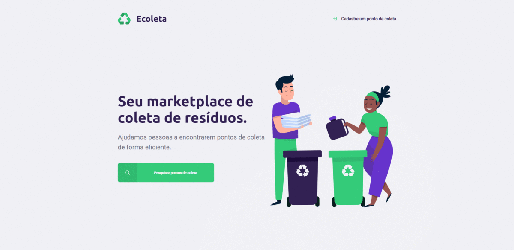

# Ecoleta Web Application

The registration page for the collection point was made during Rocketseat's Next Level Week. The other pages, features, modularisations and other things were done by me as a personal challenge, as well as the application deployment.

This project was created using basically react, typescript, axios, react-icons, leaflet (to create the map) and react-dropzone to upload images.

## Instalation

`npm install`

## Start the app

`npm start`

## Live demo

https://ecoleta-gabrielmendes98.netlify.app/
